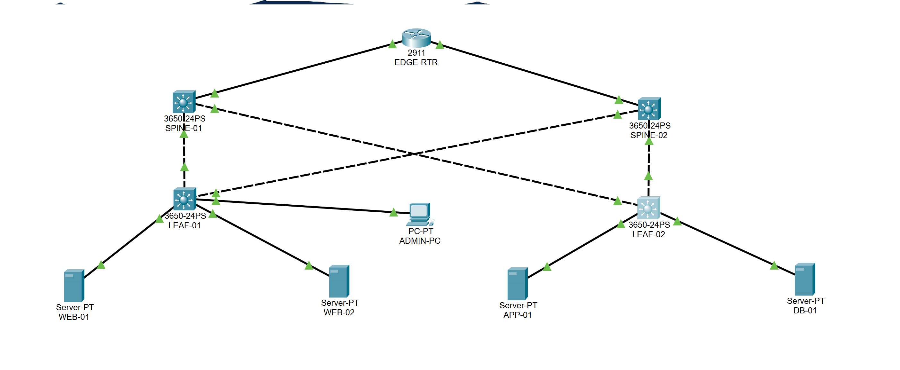
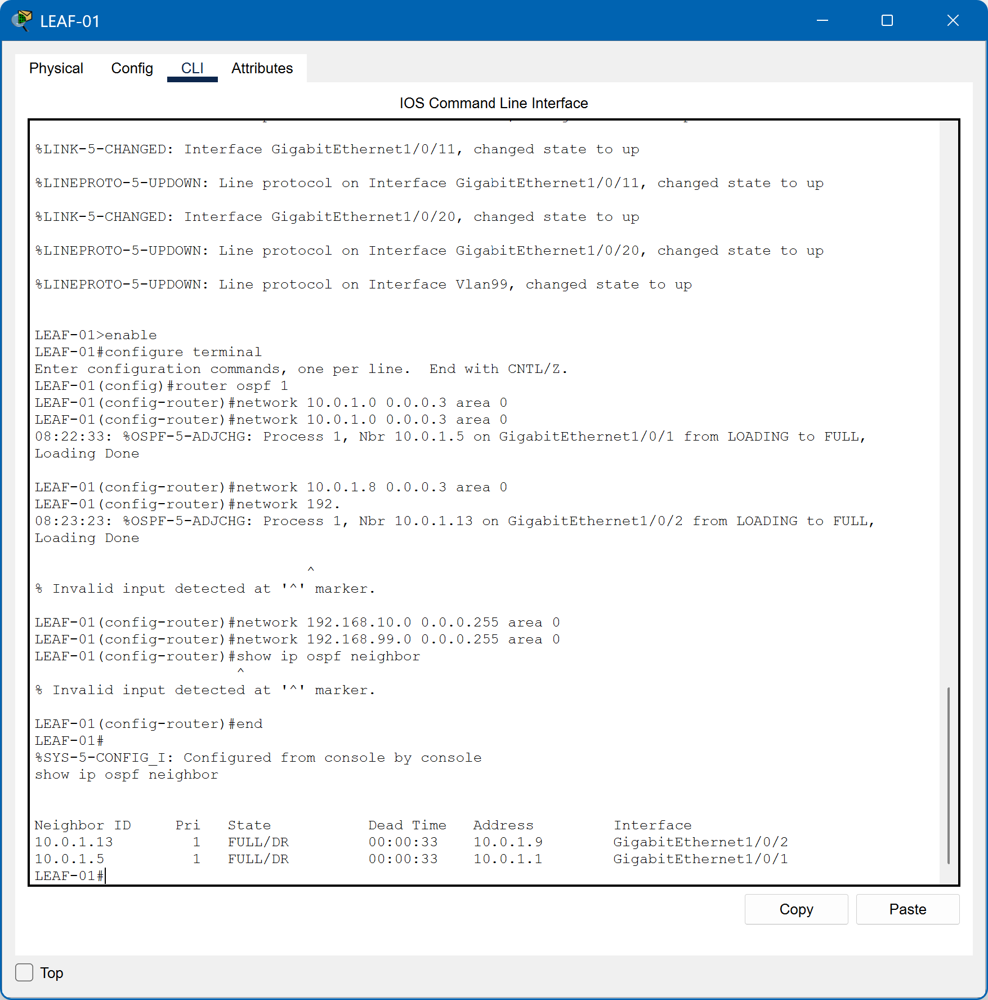
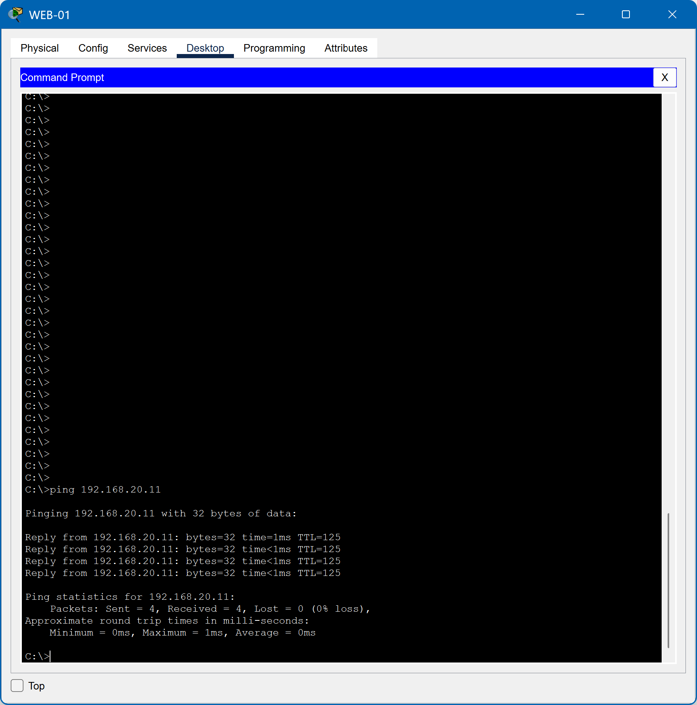
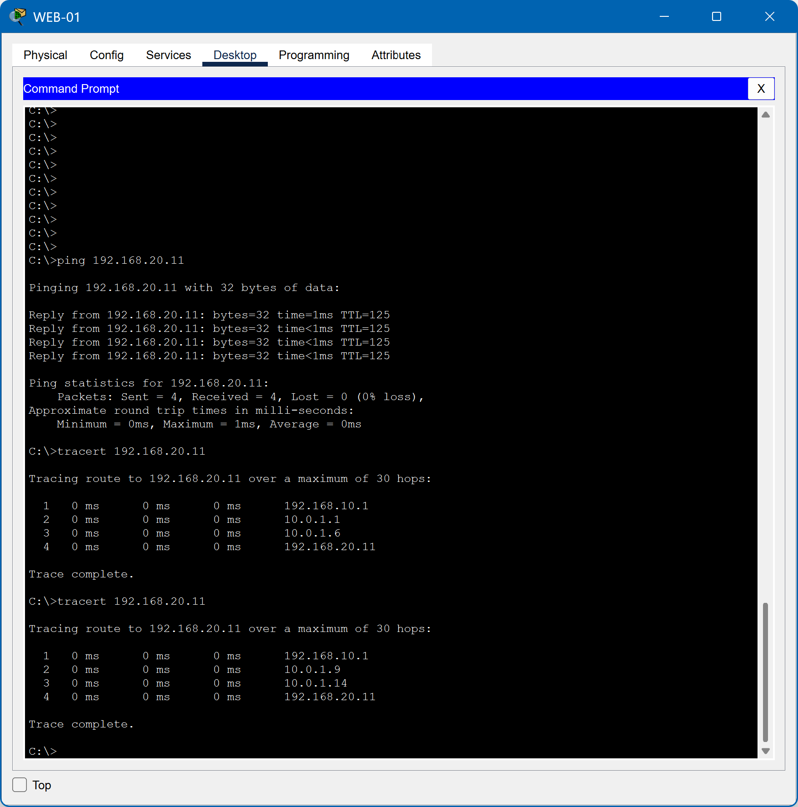

# Data Center Network Redundancy & Troubleshooting Lab

## Project Overview

This project simulates a redundant data center network built in Cisco Packet Tracer using a Layer 3 spine-leaf architecture.

The environment includes segmented web, application, database, and management networks connected through redundant spine switches. OSPF was configured across the routed fabric to provide dynamic route exchange and automatic path failover.

After validating normal connectivity, the LEAF-01 to SPINE-01 uplink was intentionally disabled to simulate a network failure. OSPF detected the topology change and automatically rerouted traffic through SPINE-02 while maintaining end-to-end connectivity between the web and application networks.

The failed link was then restored, the OSPF adjacency re-formed, and the network returned to its normal redundant state.



## Skills Demonstrated

- Data Center Networking
- Spine-Leaf Architecture
- Cisco IOS
- Layer 2 and Layer 3 Switching
- VLAN Configuration
- Inter-VLAN Routing
- IP Addressing and Subnetting
- OSPF Dynamic Routing
- Network Redundancy
- Route Failover
- Network Troubleshooting
- Connectivity Verification
- Fault Isolation
- Service Restoration

## Network Architecture

The lab uses a redundant spine-leaf design consisting of:

- 1 Edge Router
- 2 Spine Layer 3 Switches
- 2 Leaf Layer 3 Switches
- 2 Web Servers
- 1 Application Server
- 1 Database Server
- 1 Administrative Workstation

Each leaf switch maintains a routed connection to both spine switches. OSPF provides dynamic route exchange and allows traffic to automatically move to the remaining spine path if an uplink fails.

## VLAN and Server Networks

| VLAN | Purpose | Network | Gateway | Devices |
|---|---|---|---|---|
| 10 | Web Servers | 192.168.10.0/24 | 192.168.10.1 | WEB-01, WEB-02 |
| 20 | Application | 192.168.20.0/24 | 192.168.20.1 | APP-01 |
| 30 | Database | 192.168.30.0/24 | 192.168.30.1 | DB-01 |
| 99 | Management | 192.168.99.0/24 | 192.168.99.1 | ADMIN-PC |

## Endpoint Addressing

| Device | IP Address | Default Gateway |
|---|---|---|
| WEB-01 | 192.168.10.11 | 192.168.10.1 |
| WEB-02 | 192.168.10.12 | 192.168.10.1 |
| APP-01 | 192.168.20.11 | 192.168.20.1 |
| DB-01 | 192.168.30.11 | 192.168.30.1 |
| ADMIN-PC | 192.168.99.10 | 192.168.99.1 |

## Routed Fabric

| Connection | Network |
|---|---|
| EDGE-RTR ↔ SPINE-01 | 10.0.0.0/30 |
| EDGE-RTR ↔ SPINE-02 | 10.0.0.4/30 |
| SPINE-01 ↔ LEAF-01 | 10.0.1.0/30 |
| SPINE-01 ↔ LEAF-02 | 10.0.1.4/30 |
| SPINE-02 ↔ LEAF-01 | 10.0.1.8/30 |
| SPINE-02 ↔ LEAF-02 | 10.0.1.12/30 |

## Network Verification

After configuring the routed fabric, VLANs, gateways, and OSPF, connectivity was verified across the data center.

### OSPF Redundancy

LEAF-01 successfully formed OSPF adjacencies with both spine switches.

This confirmed that two Layer 3 paths were available from the leaf switch into the data center fabric.



### Cross-Fabric Connectivity

Connectivity was tested from WEB-01 to APP-01 across the routed spine-leaf fabric.

The test returned four successful replies with 0% packet loss, confirming end-to-end communication between the web and application networks.



## Failure Simulation and Troubleshooting

After establishing normal connectivity across the data center, the uplink between LEAF-01 and SPINE-01 was intentionally shut down to simulate a network path failure.

Before the failure, traffic from WEB-01 to APP-01 followed the SPINE-01 path:

```text
WEB-01
→ LEAF-01
→ SPINE-01
→ LEAF-02
→ APP-01
```

After the uplink was disabled, OSPF detected the topology change and recalculated the route.

Traffic automatically failed over to SPINE-02:

```text
WEB-01
→ LEAF-01
→ SPINE-02
→ LEAF-02
→ APP-01
```

A second traceroute confirmed that the traffic path had changed while the destination remained reachable.



## Incident Resolution

The failed LEAF-01 to SPINE-01 uplink was restored using the `no shutdown` command.

After the interface returned to service, OSPF re-established the neighbor relationship and both redundant spine paths became available again.

This validated the full troubleshooting cycle:

**Normal Operation → Simulated Failure → Route Failover → Connectivity Verification → Link Restoration → OSPF Reconvergence**

## Conclusion

This project demonstrated the design, configuration, verification, and troubleshooting of a redundant Layer 3 data center network.

The lab combined spine-leaf architecture, VLAN segmentation, inter-VLAN routing, OSPF dynamic routing, and redundant uplinks into a working environment supporting web, application, database, and management networks.

The failure simulation demonstrated the most important objective of the project: maintaining connectivity when a network path becomes unavailable. OSPF automatically redirected traffic through the remaining spine path, and normal redundancy was restored after the failed link returned to service.

The project provided hands-on practice with network cabling, Cisco IOS configuration, IP addressing, route verification, fault isolation, redundancy, and service restoration.
